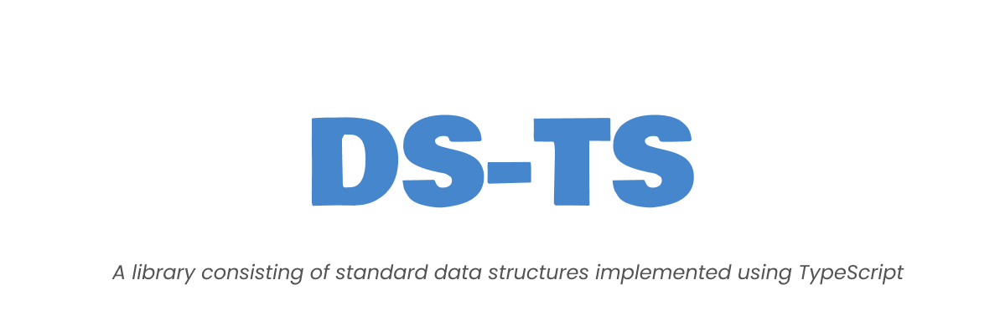

**DS-TS** is a _TypeScript_ library consisting of _standard data structures_ provided through a simple API.

## Getting Started

## Installation

```bash
npm install ds-ts
```

## Usage

**Example 1 - Using a _stack_ of numbers.**

```typescript
import { Stack } from "ds-ts";

/** Initialize a new empty stack. */
const stack = new Stack<number>();

/** Stack is empty */
stack.size; // returns 0.
stack.isEmpty; // returns true.

/** Add elements using push method. */
stack.push(25);

/** push method can accept one or more arguments. */
stack.push(10, 11);

/** pushAll method can be used to push multiple elements at once using a list of values. */
stack.pushAll([5, 6, 7]);

/** pop method removes a value from the top of the stack and returns it. */
stack.pop(); // returns 7

/** peek method returns the value at the top of the stack without removing it from the stack. */
stack.peek(); // returns 6

/** toArray method returns a list of all the values in the stack. */
stack.toArray(); // returns [6, 5, 11, 10, 25]
```

---

**Example 2 - Using a _Binary Search tree_ with a complex custom data type.**

```typescript
import { BinarySearchTree } from "ds-ts";
import type { CompareFunc, EqualsFunc } from "ds-ts";

type Vehicle = {
  brand: string;
  cost: number;
};

const vehicles: Vehicle[] = [
  {
    brand: "Tata",
    cost: 300,
  },
  {
    brand: "Tesla",
    cost: 800,
  },
  {
    brand: "Mercedes",
    cost: 550,
  },
  {
    brand: "BMW",
    cost: 620,
  },
];

/**
 * Comparison logic for our custom Vehicle type.
 * @param {Vehicle} a
 * @param {Vehicle} b
 * @returns {1 | -1 | 0}
 */
const compare: CompareFunc<Vehicle> = function (
  a: Vehicle,
  b: Vehicle
): 1 | -1 | 0 {
  if (+a.cost > +b.cost) return 1;
  else if (+a.cost < +b.cost) return -1;
  else return 0;
};

/**
 * Equality logic for our custom Vehicle type.
 * @param {Vehicle} a
 * @param {Vehicle} b
 * @returns {boolean}
 */
const equals: EqualsFunc<Vehicle> = function (a: Vehicle, b: Vehicle): boolean {
  return a.brand === b.brand && +a.cost === +b.cost;
};

/** Initialize an empty binarySearchtree using the custom equality and compare functions. */
const binarySearchTree = new BinarySearchTree<Vehicle>([], compare, equals);

/** Initially the tree is empty. */
binarySearchTree.isEmpty; // returns true.
binarySearchTree.height; // returns 0.

/** Insert an element into the tree using insert method. */
binarySearchTree.insert({
  brand: "Porsche",
  cost: 750,
});

/** Insert method is variadic and can accept one or more arguments. */
binarySearchTree.insert(
  {
    brand: "Jeep",
    cost: 600,
  },
  {
    brand: "Toyota",
    cost: 400,
  }
);

/** Insert all method can be used to add multiple elements by passing a list as an argument. */
binarySearchTree.insertAll(vehicles);

/** has method can be used to check if a value exists in the tree. */
binarySearchTree.has({
  brand: "Mercedes",
  cost: 550,
}); // returns true.

binarySearchTree.has({
  brand: "Lamborghini",
  cost: "999",
}); // returns false.

/** remove method can be used to remove a node from the tree. */
binarySearchTree.remove({
  brand: "Mercedes",
  cost: 550,
}); // returns { brand: "Mercedes", cost: 550 } (the removed node).

/** traverse method can be used to traverse the tree. The default traversal is in_order traversal */
console.log(binarySearchTree.traverse()); /**
    Same as binarySearchTree.traverse("IN_ORDER").
    returns [
              { brand: 'Tata', cost: 300 },
              { brand: 'Toyota', cost: 400 },
              { brand: 'Jeep', cost: 600 },
              { brand: 'BMW', cost: 620 },
              { brand: 'Porsche', cost: 750 },
              { brand: 'Tesla', cost: 800 }
            ] (the in-order traversal)
*/
```

## API Reference

Visit the [ds-ts](https://rb.gy/c4ruz) reference documentation page for a more comprehensive coverage of the API.

## License

DS-TS is offered under the [MIT License](./LICENSE).

## Note

Please note that although the library has been effectively tested, the author _does not provide any correctness or performance guarantees and assurances_. Feel free to incorporate and use this library in any way _by your own volition_.
